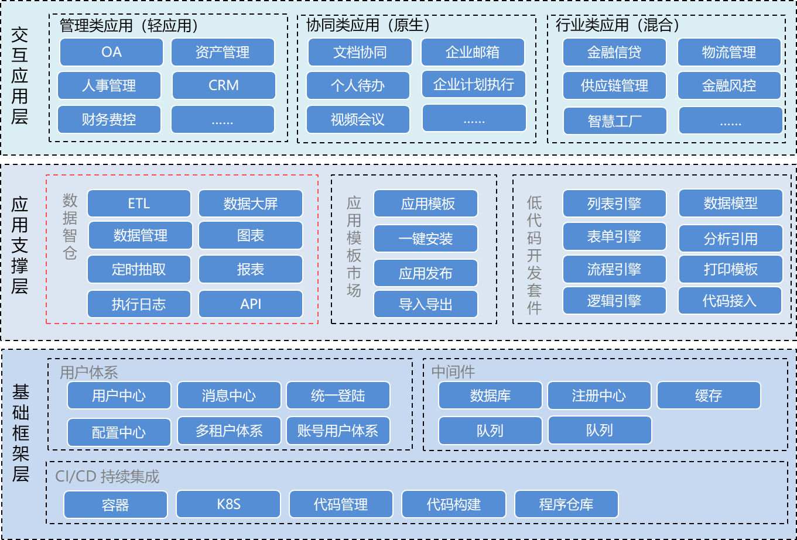
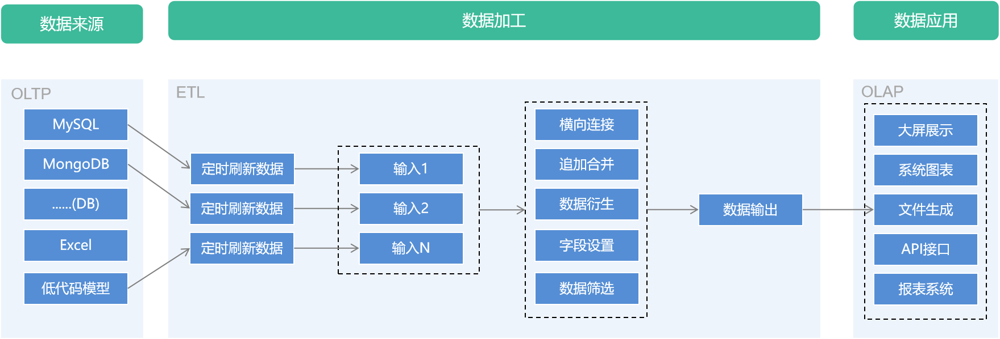
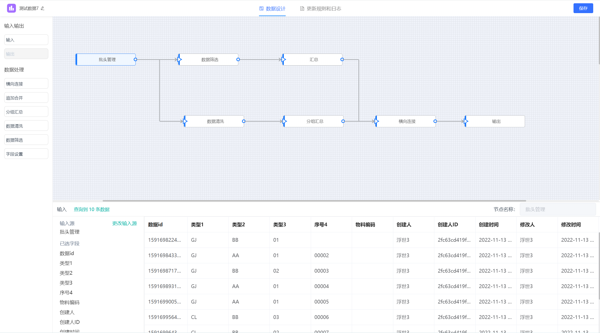
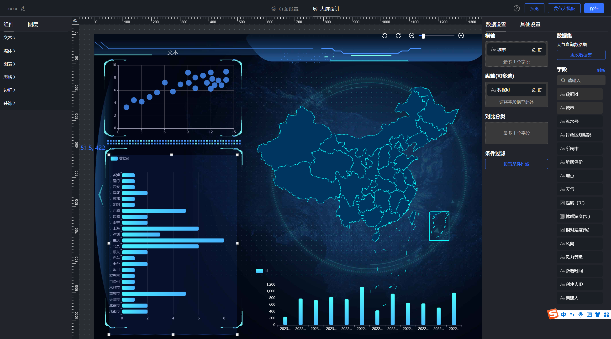
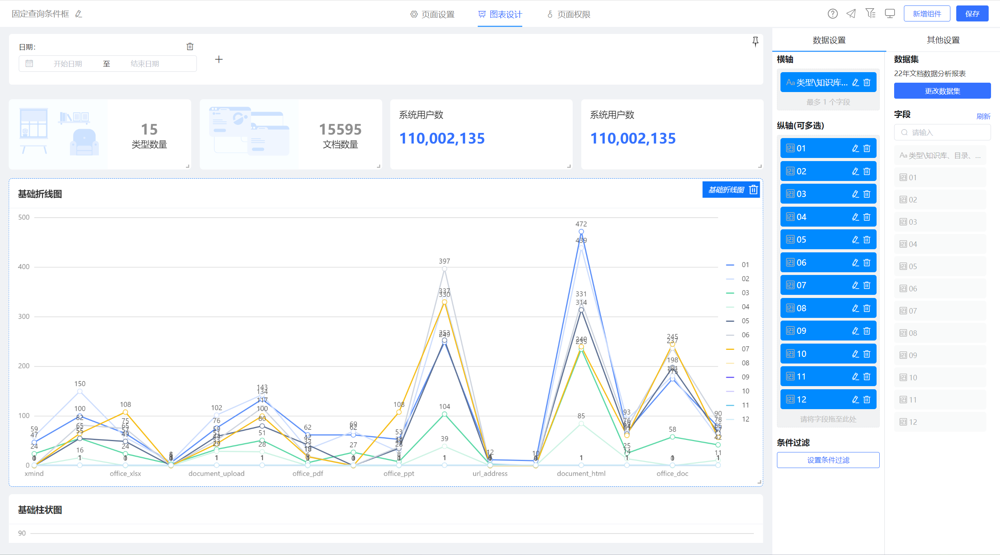
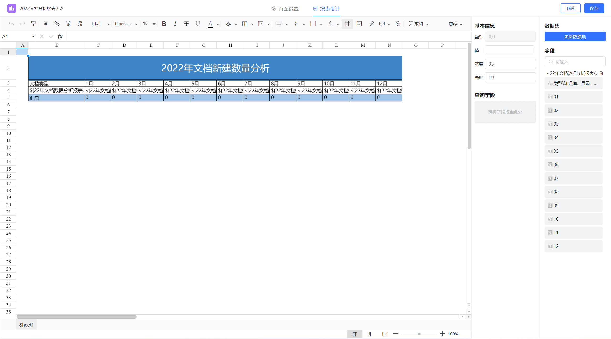
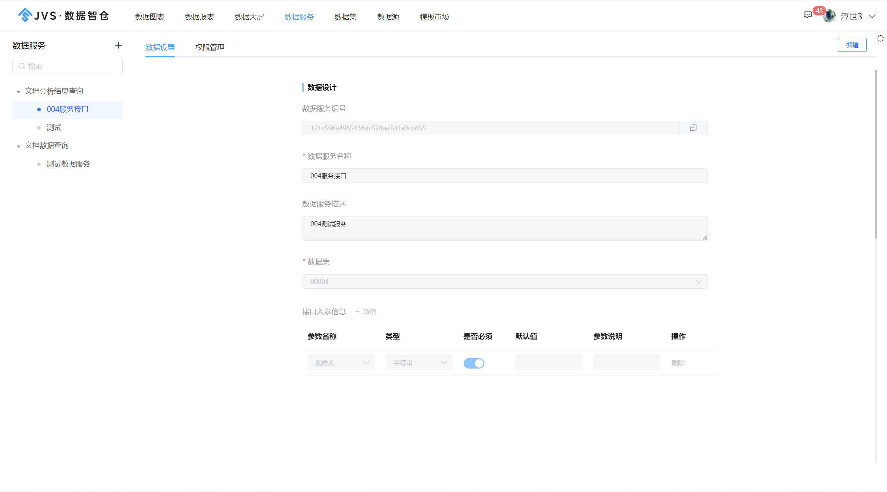
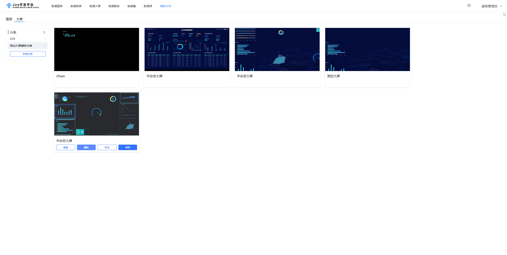

# jvs-BI（自助式数据分析平台-智能BI）

#### 介绍
数据智仓英文名称为Smart Data Warehouse，可简写为SDW。数据智仓是JVS整体企业数字化解决方案的核心能力，与JVS的低代码开发套件平级，如下图所示：

#### 软件逻辑结构

#### 体验地址与账号说明
账号说明：
- 普通用户端：体验者自有微信扫码登录
- 管理端(全网共享)：testadmin 123456
- 管理端+应用编辑：联系运营微信号 ruanjbz，开设独立环境与独立账号
- 管理端+平台配置+应用编辑：联系运营微信号 ruanjbz，获取私有化部署文档与安装包

地址说明：

- 管理平台（含管理平台、低代码）：https://frame.bctools.cn/
- 数据智仓（数据分析平台）：http://bi.bctools.cn/
- 企业文档：http://knowledge.bctools.cn/
- 企业计划（项目管理）：http://teamwork.bctools.cn/
- 企业邮筒（Web邮箱客户端）：http://mailbox.bctools.cn/
- 规则引擎：http://rules.bctools.cn/
- 逻辑引擎：http://logic.bctools.cn/
- 视频会议：http://meeting.bctools.cn/
- APS（智能排产）：https://aps.bctools.cn/

#### 重点功能截图
多数据源管理
多数据源是用来对接各种各样的数据输入来源。例如各种数据库、低代码的数据模型、外部的API接口等，通过统一的数据源，可以实现各类数据连接的管理，是后续数据分析操作中数据的来源；

数据集管理
数据集是体系内对数据加工后生成的标准数据集合，这种集合可以快速用于数据的展现与数据服务，数据集管理是快速创建对各种来源数据进行统一的界面化加工，形成标准的数据输出格式。这里核心的功能是可视化界面加工--数据加工引擎，数据加工引擎

ETL是将业务系统的数据经过抽取、清洗转换之后加载到数据仓库的过程，是构建数据仓库的重要一环，用户从数据源抽取出所需的数据，经过数据清洗，最终按照预先定义好的数据仓库模型，将数据加载到数据仓库中。目的是将企业中的分散、零乱、标准不统一的数据整合到一起，为企业的决策提供分析依据。

大屏配置引擎
数据大屏是通过拖拽化的配置，实现大屏的展示。

图表配置引擎
通过拖拽化的方式对数据实现可视化的渲染，支持多种图形组件。

报表配置引擎
通过拖拽化实现数据报表的展示，简洁操作。

数据开放服务
数据开放服务是将标准的数据集向外提供可配置化的API服务，如下图所示：

模板市场
模板市场是系统提供的已经做过的一些配置化的demo，提供给用户可以快速创建对应页面，实现简单调整即可使用。

### 技术交流与商务支持

如因人数限制无法加群时，可加运营同学拉入技术交流群

